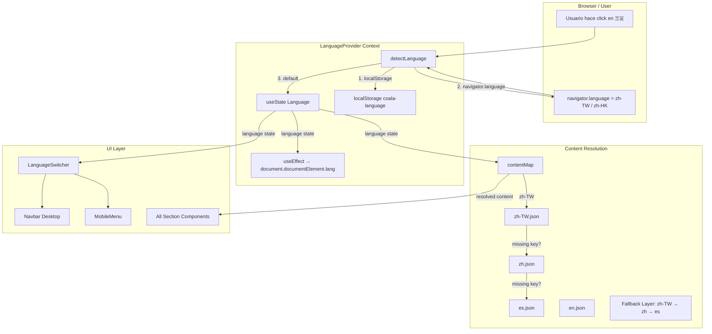

# Design Document — FEAT-002: Soporte Chino Tradicional (ZH-TW)

**Spec Version:** 6.7  
**Feature ID:** FEAT-002  
**Slug:** feat-002-i18n-zhtw  
**Status:** DESIGN_DRAFT

---

## 1. Architecture Overview — i18n System Post-FEAT-002



---

## 2. Type System Design

### 2.1 Language Type Extension

```typescript
// src/hooks/useLanguage.tsx — Línea 4 (MODIFICADO)

// BEFORE:
export type Language = 'es' | 'en' | 'zh';

// AFTER:
export type Language = 'es' | 'en' | 'zh' | 'zh-TW';
```

### 2.2 Complete Interface Definitions

```typescript
// ─── useLanguage.tsx ───

export type Language = 'es' | 'en' | 'zh' | 'zh-TW';

interface LanguageContextValue {
  language: Language;
  setLanguage: (lang: Language) => void;
}

// ─── Constantes ───

const STORAGE_KEY = 'coala-language'; // Sin cambios

const LANGUAGES: Language[] = ['es', 'en', 'zh', 'zh-TW']; // Extendido

// ─── Content Map ───

export const contentMap: Record<Language, typeof esContent> = {
  es: esContent,
  en: enContent,
  zh: zhContent,
  'zh-TW': zhTWContent,  // NUEVO
};

// ─── Fallback Map (NUEVO) ───

const FALLBACK_MAP: Partial<Record<Language, Language>> = {
  'zh-TW': 'zh',   // zh-TW → zh si falta clave
};

// ─── Content Resolver con Fallback (NUEVO) ───

function resolveContent(lang: Language, keyPath: string[]): string {
  const primary = contentMap[lang];
  const value = getNestedValue(primary, keyPath);
  if (value !== undefined) return value;

  const fallbackLang = FALLBACK_MAP[lang];
  if (fallbackLang) {
    if (import.meta.env.DEV) {
      console.warn(`[i18n] Missing key "${keyPath.join('.')}" in ${lang}, falling back to ${fallbackLang}`);
    }
    const fallbackValue = getNestedValue(contentMap[fallbackLang], keyPath);
    if (fallbackValue !== undefined) return fallbackValue;
  }

  // Ultimate fallback: es
  if (import.meta.env.DEV) {
    console.warn(`[i18n] Missing key "${keyPath.join('.')}" in all languages, falling back to es`);
  }
  return getNestedValue(contentMap['es'], keyPath) ?? '';
}

function getNestedValue(obj: Record<string, unknown>, path: string[]): string | undefined {
  let current: unknown = obj;
  for (const key of path) {
    if (current == null || typeof current !== 'object') return undefined;
    current = (current as Record<string, unknown>)[key];
  }
  return typeof current === 'string' ? current : undefined;
}
```

### 2.3 LanguageSwitcher Types

```typescript
// src/components/layout/LanguageSwitcher.tsx (MODIFICADO)

const FLAGS: Record<Language, string> = {
  es: '🇪🇸',
  en: '🇬🇧',
  zh: '🇨🇳',
  'zh-TW': '🇹🇼',       // NUEVO
};

const LABELS: Record<Language, string> = {
  es: 'ES',
  en: 'EN',
  zh: '中文',
  'zh-TW': '繁體中文',    // NUEVO
};
```

---

## 3. detectLanguage() Update

```typescript
// src/hooks/useLanguage.tsx

function detectLanguage(): Language {
  // 1. localStorage
  const stored = localStorage.getItem(STORAGE_KEY);
  if (isValidLanguage(stored)) return stored;

  // 2. navigator.language — soporte completo de locale
  const browserLang = navigator.language.toLowerCase();

  // Coincidencia exacta: zh-TW, zh-HK
  if (browserLang === 'zh-tw' || browserLang === 'zh-hk') return 'zh-TW';

  // Coincidencia parcial: zh (simplificado)
  if (browserLang.startsWith('zh')) return 'zh';

  // Coincidencia directa: es, en
  const shortLang = browserLang.slice(0, 2);
  if (isValidLanguage(shortLang)) return shortLang;

  // 3. Default
  return 'es';
}
```

---

## 4. HTML Lang Attribute Update

```typescript
// src/hooks/useLanguage.tsx — useEffect (MODIFICADO)

useEffect(() => {
  // BEFORE:
  // document.documentElement.lang = language === 'zh' ? 'zh-CN' : language;

  // AFTER:
  switch (language) {
    case 'zh':
      document.documentElement.lang = 'zh-CN';
      break;
    case 'zh-TW':
      document.documentElement.lang = 'zh-TW';
      break;
    default:
      document.documentElement.lang = language;
  }
}, [language]);
```

---

## 5. Data File: zh-TW.json Structure

```typescript
// src/data/zh-TW.json — Estructura idéntica a es.json (144 líneas)

{
  "navbar": {
    "logo": "COALA SwarmOPS",
    "links": [
      { "text": "首頁", "href": "#hero" },
      { "text": "運作方式", "href": "#how-it-works" },
      { "text": "模式", "href": "#modes" },
      { "text": "價格", "href": "#pricing" },
      { "text": "社群", "href": "#community" }
    ]
  },
  "hero": {
    "id": "hero",
    "title": "COALA-SwarmOPS",
    "subtitle": "AI 智慧體生態系統",
    "description": "編排你自己的 AI 智慧體生態系統。省錢、擴展專案、保持完全控制，使用我們經過實戰測試的設定。",
    "tagline": "停止為單一智慧體付費。統籌所有。",
    "ctas": [
      { "text": "GitHub 贊助", "href": "...", "variant": "primary", "icon": "Heart" },
      { "text": "立即安裝", "href": "...", "variant": "secondary", "icon": "Download" },
      { "text": "文件", "href": "...", "variant": "outline", "icon": "BookOpen" }
    ]
  }
  // ... resto de secciones con caracteres tradicionales
}
```

---

## 6. CSS Font Stack para ZH-TW

```css
/* src/index.css — NUEVO bloque */

/* Font stack para Chino Tradicional */
:root {
  --font-zh-tw: "Noto Sans TC", "Microsoft JhengHei", "PingFang TC", "蘋方-繁", "Heiti TC", "黑體-繁", system-ui, -apple-system, sans-serif;
}

/* Aplicar solo cuando lang="zh-TW" */
html[lang="zh-TW"] body {
  font-family: var(--font-zh-tw);
  word-break: keep-all;
  overflow-wrap: break-word;
}

/* Prevenir que caracteres CJK rompan layout en contenedores estrechos */
html[lang="zh-TW"] .text-balance {
  text-wrap: balance;
}
```

---

## 7. Component Interaction Diagram (Post-FEAT-002)

```
App.tsx
└── LanguageProvider (useLanguage context)
    ├── Navbar
    │   ├── LanguageSwitcher
    │   │   ├── 🇪🇸 ES (es)
    │   │   ├── 🇬🇧 EN (en)
    │   │   ├── 🇨🇳 中文 (zh)
    │   │   └── 🇹🇼 繁體中文 (zh-TW)  ← NUEVO
    │   └── ThemeToggle
    ├── MobileMenu
    │   └── LanguageSwitcher (misma instancia, responsive)
    ├── HeroSection
    ├── ProblemSection
    ├── SolutionSection
    ├── HowItWorksSection
    ├── ModesShowcaseSection
    ├── WhoIsItForSection
    ├── PricingSection
    ├── CommunitySection
    └── Footer
```

---

## 8. Fallback Strategy

```
Resolución de contenido:
  1. Buscar clave en zh-TW.json
  2. Si no existe → buscar en zh.json (simplificado)
  3. Si no existe → buscar en es.json (idioma base)
  4. Si no existe → retornar string vacío + console.warn en DEV

Persistencia:
  1. Leer localStorage['coala-language']
  2. Si es válido → usar
  3. Si no → leer navigator.language
  4. Si zh-TW/zh-HK → 'zh-TW'
  5. Si zh-* → 'zh'
  6. Si es/en → usar directo
  7. Default → 'es'
```

---

## 9. Performance Considerations

| Aspecto | Estrategia |
|---------|------------|
| Bundle size | zh-TW.json ~5KB adicionales. No requiere lazy loading inicial (≤ threshold 500KB) |
| Cambio de idioma | Síncrono <200ms. contentMap es un lookup O(1) |
| Re-renders | Solo componentes que consumen `useLanguage()` se re-renderizan |
| Font loading | `font-display: swap` en @font-face si se usan fuentes CJK; system-ui como fallback inmediato |
| Debounce | 150ms debounce en setLanguage para evitar race conditions |

---

## 10. Security

- El contenido de `zh-TW.json` es estático, no hay riesgo de XSS.
- Los textos se renderizan como `{content}` en JSX (escapado automático de React).
- No se usa `dangerouslySetInnerHTML` para contenido i18n.
- La clave `coala-language` en localStorage es solo lectura/escritura, sin impacto de seguridad.

---

## 11. Rollback Plan

Si FEAT-002 causa regresiones:

1. Revertir [`useLanguage.tsx`](src/hooks/useLanguage.tsx) — eliminar `'zh-TW'` del tipo y constantes
2. Revertir [`LanguageSwitcher.tsx`](src/components/layout/LanguageSwitcher.tsx) — eliminar entrada zh-TW
3. Eliminar [`src/data/zh-TW.json`](src/data/zh-TW.json)
4. El sistema vuelve a 3 idiomas sin pérdida de funcionalidad

---

## 12. Decision Log

| ID | Decisión | Alternativas Consideradas | Razón |
|----|----------|--------------------------|-------|
| D01 | `'zh-TW'` como valor del tipo | `'zhtw'`, `'zh_Hant'` | `'zh-TW'` sigue BCP 47, coincide con `navigator.language` |
| D02 | Fallback zh-TW → zh | Sin fallback (keys faltantes = error) | Experiencia de usuario: mejor mostrar simplificado que nada |
| D03 | Content map estático | Lazy load dinámico | Simplicidad; 4 archivos JSON <20KB total |
| D04 | Debounce 150ms | Sin debounce | Previene race conditions en cambios rápidos |
| D05 | Bandera 🇹🇼 para zh-TW | 🇭🇰, 🀄 | Taiwán es el principal mercado de chino tradicional |
| D06 | Font stack con system-ui fallback | Google Fonts CDN | Zero dependencias externas; consistente con el resto del proyecto |
