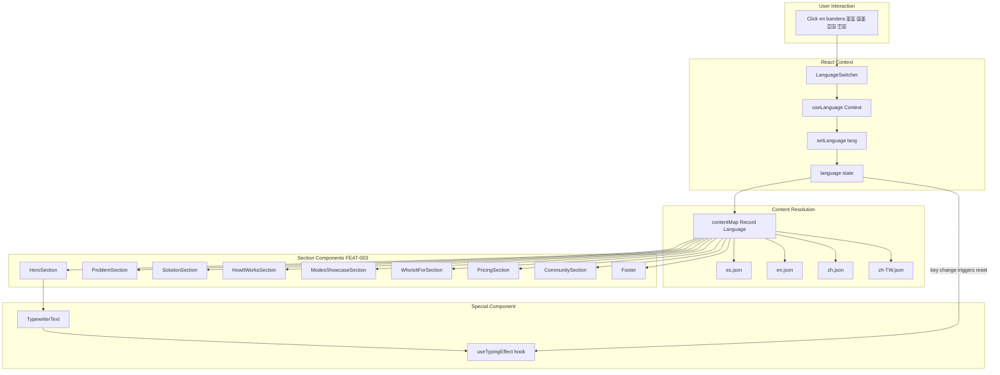
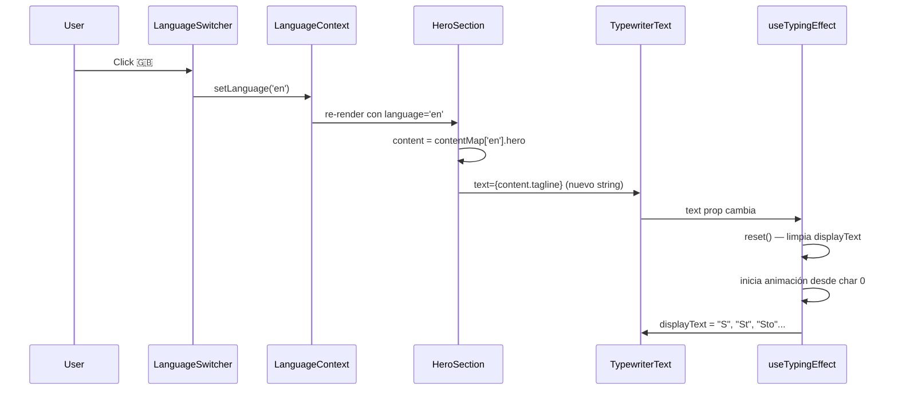

# Design Document — FEAT-003: Conectar Componentes al Sistema i18n

**Spec Version:** 6.7  
**Feature ID:** FEAT-003  
**Slug:** feat-003-connect-i18n  
**Status:** DESIGN_DRAFT  
**Depends On:** FEAT-002 (completado — sistema i18n + zh-TW)

---

## 1. Architecture Overview — Post-FEAT-003 i18n Flow



---

## 2. Core Pattern: Before/After Transformation

### 2.1 The Universal Refactor Pattern

**ANTES (hardcodeado — estado actual):**
```tsx
// Opción A: strings hardcodeados en JSX (HeroSection, Footer)
function HeroSection() {
  return <h1>COALA-SwarmOPS</h1>;
}

// Opción B: import estático de es.json (ProblemSection, SolutionSection, etc.)
import content from '../../data/es.json';
function ProblemSection() {
  return <h2>{content.problem.title}</h2>;
}
```

**DESPUÉS (conectado a i18n):**
```tsx
import { useLanguage, contentMap } from '../../hooks/useLanguage';

function HeroSection() {
  const { language } = useLanguage();
  const content = contentMap[language].hero;
  return <h1>{content.title}</h1>;
}
```

### 2.2 Component Transformation Matrix

| # | Component | Estado Actual | Cambio Requerido | Complejidad |
|---|-----------|---------------|------------------|-------------|
| 1 | [`HeroSection.tsx`](src/components/sections/HeroSection.tsx) | Strings hardcodeados + TAGLINES array | `useLanguage` + `contentMap[language].hero` + TypewriterText dinámico | ALTA |
| 2 | [`ProblemSection.tsx`](src/components/sections/ProblemSection.tsx) | `import es.json` estático + strings hardcodeados en comparación Static/Swarm | `useLanguage` + `contentMap[language].problem` + mover comparación a JSON | ALTA |
| 3 | [`SolutionSection.tsx`](src/components/sections/SolutionSection.tsx) | `import es.json` estático | `useLanguage` + `contentMap[language].solution` | BAJA |
| 4 | [`HowItWorksSection.tsx`](src/components/sections/HowItWorksSection.tsx) | `import es.json` estático | `useLanguage` + `contentMap[language].howItWorks` | BAJA |
| 5 | [`ModesShowcaseSection.tsx`](src/components/sections/ModesShowcaseSection.tsx) | `import es.json` estático + string hardcodeado en CTA | `useLanguage` + `contentMap[language].modesShowcase` + usar `ctas[0].text` | BAJA |
| 6 | [`WhoIsItForSection.tsx`](src/components/sections/WhoIsItForSection.tsx) | `import es.json` estático | `useLanguage` + `contentMap[language].whoIsItFor` | BAJA |
| 7 | [`PricingSection.tsx`](src/components/sections/PricingSection.tsx) | `import es.json` estático + strings hardcodeados | `useLanguage` + `contentMap[language].pricing` + eliminar hardcodeos | MEDIA |
| 8 | [`CommunitySection.tsx`](src/components/sections/CommunitySection.tsx) | `import es.json` estático + strings hardcodeados | `useLanguage` + `contentMap[language].community` + eliminar hardcodeos | MEDIA |
| 9 | [`Footer.tsx`](src/components/layout/Footer.tsx) | 100% hardcodeado, sin import de datos | `useLanguage` + `contentMap[language].footer` | BAJA |

---

## 3. TypeScript Interfaces — Post-FEAT-003

### 3.1 Language Type (sin cambios)

```typescript
// src/hooks/useLanguage.tsx — Línea 4 (SIN CAMBIOS)
export type Language = 'es' | 'en' | 'zh' | 'zh-TW';
```

### 3.2 Content Map (sin cambios estructurales)

```typescript
// src/hooks/useLanguage.tsx — Línea 48 (SIN CAMBIOS)
export const contentMap: Record<Language, typeof esContent> = {
  es: esContent,
  en: enContent,
  zh: zhContent,
  'zh-TW': zhTWContent,
};
```

### 3.3 JSON Schema Extension — `problem.comparison` (NUEVO)

Los 4 archivos JSON reciben una nueva clave `comparison` dentro de `problem` para la sección "Static vs Swarm" actualmente hardcodeada en [`ProblemSection.tsx`](src/components/sections/ProblemSection.tsx:58).

```typescript
// Extensión del tipo inferido de es.json
interface ProblemComparison {
  staticTitle: string;       // "Static Workflow"
  swarmTitle: string;        // "Swarm Workflow"
  staticItems: string[];     // 4 bullets de la columna roja
  swarmItems: string[];      // 4 bullets de la columna cyan
}

interface ProblemSection {
  // ... campos existentes
  comparison: ProblemComparison;  // NUEVO
}
```

### 3.4 JSON Schema Extension — `community.repos` (NUEVO)

```typescript
interface CommunityRepo {
  title: string;             // "COALA-SwarmOPS v2"
  description: string;       // "Versión actual con swarm 6.7..."
  cta: string;               // "GitHub (v2)"
}

interface CommunitySection {
  // ... campos existentes
  repos: CommunityRepo[];    // NUEVO — [v2, v1]
}
```

### 3.5 JSON Schema Extension — `pricing.popularBadge` y `pricing.freeMessage` (NUEVO)

```typescript
interface PricingSection {
  // ... campos existentes
  popularBadge: string;      // "Más popular"
  freeMessage: string;       // "COALA-SwarmOPS es 100% open source..."
}
```

### 3.6 Component Hook Signature (igual para todos)

```typescript
// Patrón estándar para los 9 componentes
import { useLanguage, contentMap } from '../../hooks/useLanguage';

function AnySection() {
  const { language } = useLanguage();
  const content = contentMap[language].sectionKey; // .hero, .problem, etc.
  
  return (
    // JSX usando content.title, content.description, content.ctas, etc.
  );
}
```

---

## 4. TypewriterText — Reinicio al Cambiar Idioma

### 4.1 Problema

[`TypewriterText`](src/components/ui/TypewriterText.tsx) recibe `text` como prop y lo pasa a [`useTypingEffect`](src/hooks/useTypingEffect.ts). Cuando el idioma cambia, `content.hero.tagline` cambia, pero el hook `useTypingEffect` ya tiene un `useEffect` que hace `reset()` cuando `text` cambia ([`useTypingEffect.ts:45`](src/hooks/useTypingEffect.ts:45)).

### 4.2 Verificación de Comportamiento Existente

```typescript
// useTypingEffect.ts — Líneas 45-47 (YA EXISTE)
useEffect(() => {
  reset();
}, [text, reset]);
```

**Conclusión:** El hook ya reinicia cuando `text` cambia. Al cambiar `language`, `contentMap[language].hero.tagline` produce un nuevo string, que activa el `useEffect` de `useTypingEffect`, que llama `reset()`. **No se requiere modificar TypewriterText ni useTypingEffect.**

### 4.3 Cambio en HeroSection.tsx

```tsx
// ANTES
const TAGLINES = [
  'Orquesta tu ecosistema de agentes IA',
  'Ahorra plata en AI agents',
  'Instala en 5 minutos',
  'Configuración battle-tested',
];

<TypewriterText
  text={TAGLINES[0]}  // solo la primera tagline
  speed={60}
  delay={2000}
  loop={true}
/>

// DESPUÉS
<TypewriterText
  text={content.tagline}  // viene de contentMap[language].hero.tagline
  speed={60}
  delay={2000}
  loop={true}
/>
```

### 4.4 Diagrama de Flujo TypewriterText + Cambio de Idioma



---

## 5. Data Layer Changes

### 5.1 Nuevas Claves en los 4 JSON

| Archivo | Sección | Nueva Clave | Tipo | Contenido |
|---------|---------|-------------|------|-----------|
| [`es.json`](src/data/es.json) | `problem` | `comparison` | `object` | Static vs Swarm (4+4 bullets) |
| [`es.json`](src/data/es.json) | `pricing` | `popularBadge` | `string` | "Más popular" |
| [`es.json`](src/data/es.json) | `pricing` | `freeMessage` | `string` | Mensaje "100% open source..." |
| [`es.json`](src/data/es.json) | `community` | `repos` | `array` | 2 objetos con title, description, cta |
| [`en.json`](src/data/en.json) | `problem` | `comparison` | `object` | Traducción EN |
| [`en.json`](src/data/en.json) | `pricing` | `popularBadge` | `string` | "Most Popular" |
| [`en.json`](src/data/en.json) | `pricing` | `freeMessage` | `string` | Traducción EN |
| [`en.json`](src/data/en.json) | `community` | `repos` | `array` | Traducción EN |
| [`zh.json`](src/data/zh.json) | `problem` | `comparison` | `object` | Traducción ZH |
| [`zh.json`](src/data/zh.json) | `pricing` | `popularBadge` | `string` | "最受欢迎" |
| [`zh.json`](src/data/zh.json) | `pricing` | `freeMessage` | `string` | Traducción ZH |
| [`zh.json`](src/data/zh.json) | `community` | `repos` | `array` | Traducción ZH |
| [`zh-TW.json`](src/data/zh-TW.json) | `problem` | `comparison` | `object` | Traducción ZH-TW |
| [`zh-TW.json`](src/data/zh-TW.json) | `pricing` | `popularBadge` | `string` | "最受歡迎" |
| [`zh-TW.json`](src/data/zh-TW.json) | `pricing` | `freeMessage` | `string` | Traducción ZH-TW |
| [`zh-TW.json`](src/data/zh-TW.json) | `community` | `repos` | `array` | Traducción ZH-TW |

### 5.2 Estructura JSON Completa de Nuevas Claves

```json
// es.json — Nuevas claves en problem
{
  "problem": {
    "comparison": {
      "staticTitle": "Static Workflow",
      "swarmTitle": "Swarm Workflow",
      "staticItems": [
        "Un solo agente a la vez",
        "Cambio de contexto manual y costoso",
        "Sin memoria compartida entre tareas",
        "Propenso a errores de configuración"
      ],
      "swarmItems": [
        "Múltiples agentes coordinados",
        "Contexto compartido automáticamente",
        "Memoria de trabajo entre modos",
        "Configuración battle-tested incluida"
      ]
    }
  },
  "pricing": {
    "popularBadge": "Más popular",
    "freeMessage": "COALA-SwarmOPS es 100% open source. Free to install. Paga solo los tokens que consumas."
  },
  "community": {
    "repos": [
      {
        "title": "COALA-SwarmOPS v2",
        "description": "Versión actual con swarm 6.7, circuit breakers y CoALA",
        "cta": "GitHub (v2)"
      },
      {
        "title": "COALA-SwarmOPS v1",
        "description": "Versión original — el concepto que empezó todo",
        "cta": "GitHub (v1)"
      }
    ]
  }
}
```

---

## 6. Component Interaction Diagram — Post-FEAT-003

```
App.tsx
└── LanguageProvider (useLanguage context)
    ├── Navbar
    │   ├── LanguageSwitcher (🇪🇸 🇬🇧 🇨🇳 🇹🇼)
    │   └── ThemeToggle
    ├── MobileMenu
    │   └── LanguageSwitcher (misma instancia)
    ├── HeroSection                    ← FEAT-003: useLanguage + contentMap
    │   └── TypewriterText             ← FEAT-003: recibe content.tagline
    ├── ProblemSection                 ← FEAT-003: useLanguage + contentMap
    │   └── Static vs Swarm comparison ← FEAT-003: usa content.comparison
    ├── SolutionSection                ← FEAT-003: useLanguage + contentMap
    ├── HowItWorksSection              ← FEAT-003: useLanguage + contentMap
    ├── ModesShowcaseSection           ← FEAT-003: useLanguage + contentMap
    │   └── FlipCard grid              ← Sin cambios (modos de modes.ts)
    ├── WhoIsItForSection              ← FEAT-003: useLanguage + contentMap
    ├── PricingSection                 ← FEAT-003: useLanguage + contentMap
    ├── CommunitySection               ← FEAT-003: useLanguage + contentMap
    ├── SwarmDemoSection               ← NO incluido en FEAT-003
    └── Footer                         ← FEAT-003: useLanguage + contentMap
```

---

## 7. Fallback Strategy (Heredada de FEAT-002)

```
Resolución de contenido (por sección):
  1. contentMap[language].sectionName accede al JSON del idioma activo
  2. Si una clave falta en el JSON → TypeScript reporta error en build
  3. El tipo `Record<Language, typeof esContent>` fuerza que todos los JSON
     tengan exactamente las mismas keys que es.json
  4. En runtime, React muestra undefined → string vacío (comportamiento JSX)
  5. En DEV, se podría agregar console.warn si una prop es undefined
```

**Nota:** [`FALLBACK_MAP`](src/hooks/useLanguage.tsx:103) y [`resolveContent()`](src/hooks/useLanguage.tsx:109) fueron definidos en FEAT-002 pero no tienen consumidores. FEAT-003 no los utiliza porque cada componente accede directamente a `contentMap[language].sectionKey`. Si en el futuro se necesita fallback granular, se usará `resolveContent`.

---

## 8. Performance Considerations

| Aspecto | Estrategia |
|---------|------------|
| Re-renders | Solo componentes que consumen `useLanguage()` se re-renderizan al cambiar idioma |
| Cambio de idioma | Síncrono <200ms. `contentMap[language]` es lookup O(1) |
| Memoización | `content` se recalcula en cada render del componente; no se memoiza porque cambia con `language` |
| TypewriterText | `useTypingEffect` ya tiene `reset()` cuando `text` cambia; sin overhead adicional |
| JSON bundle | Los 4 JSON ya están en el bundle (FEAT-002). FEAT-003 no agrega nuevos archivos |
| Nuevas claves JSON | ~500 bytes adicionales por idioma (comparison + popularBadge + freeMessage + repos) |

---

## 9. Security

- El contenido de los JSON es estático. No hay riesgo de XSS.
- Los textos se renderizan como `{content.field}` en JSX (escapado automático de React).
- No se usa `dangerouslySetInnerHTML` para contenido i18n.
- Los `href` en CTAs vienen de JSON → son strings fijos, no inyectables.
- La clave `coala-language` en localStorage no se modifica; FEAT-003 solo lee.

---

## 10. Exclusiones Intencionales

| Componente | Motivo de Exclusión |
|------------|-------------------|
| [`Navbar.tsx`](src/components/layout/Navbar.tsx) | YA consume i18n (textos de navbar.links). Sin cambios necesarios. |
| [`LanguageSwitcher.tsx`](src/components/layout/LanguageSwitcher.tsx) | YA es el emisor de setLanguage. Sin cambios. |
| [`MobileMenu.tsx`](src/components/layout/MobileMenu.tsx) | Delega en LanguageSwitcher. Sin cambios. |
| [`ThemeToggle.tsx`](src/components/layout/ThemeToggle.tsx) | No tiene textos. Sin cambios. |
| [`HeroThreeBackground.tsx`](src/components/sections/HeroThreeBackground.tsx) | Solo renderiza WebGL. Sin textos. |
| [`SwarmDemoSection.tsx`](src/components/sections/SwarmDemoSection.tsx) | Contenido interactivo/demo visual. No requiere i18n inmediato. |
| Componentes UI (`GlowButton`, `AnimatedCard`, `FlipCard`, etc.) | Reciben children como props; no tienen texto propio. |

---

## 11. Rollback Plan

Si FEAT-003 causa regresiones:

1. Revertir los 9 componentes a su estado previo (restaurar `import es.json` estático o strings hardcodeados)
2. Los 4 JSON conservan las nuevas claves (no causan problemas si no se consumen)
3. El sistema i18n (useLanguage, contentMap) sigue intacto — FEAT-002 no se revierte
4. Tiempo estimado de rollback: <15 minutos

---

## 12. Decision Log

| ID | Decisión | Alternativas Consideradas | Razón |
|----|----------|--------------------------|-------|
| D01 | `useLanguage()` en cada componente vs prop drilling | Pasar `language` por props desde App | Prop drilling requiere modificar 9+ intermediarios; Context es más limpio |
| D02 | `contentMap[language].sectionKey` directo vs `useMemo` | Memoizar `content` con `useMemo` | `contentMap[language]` es O(1); useMemo overhead > beneficio |
| D03 | Mover "Static vs Swarm" a JSON vs dejarlo hardcodeado | Dejar hardcodeado | Si no está en JSON, no se traduce; rompe AC-02 |
| D04 | Agregar `comparison` dentro de `problem` vs sección separada | Nueva sección top-level `comparison` | `comparison` es parte semántica de `problem`; nesting preserva cohesión |
| D05 | `repos` dentro de `community` vs campos sueltos | `community.repoV2Title`, `community.repoV1Title` | Array de objetos es más escalable y consistente con patrones existentes |
| D06 | TypewriterText: `key={language}` vs depender de `useEffect` existente | Forzar remount con `key={language}` | `useTypingEffect` ya tiene `reset()` en cambio de `text`; `key` causaría flicker |
| D07 | No modificar `useLanguage.tsx` | Agregar helper `useContent(sectionKey)` | Simplicidad; cada componente necesita una sección distinta |
| D08 | Dejar `SwarmDemoSection` sin i18n | Conectar también SwarmDemoSection | Es demo interactiva, no textos estáticos; postergar a feature separada |
